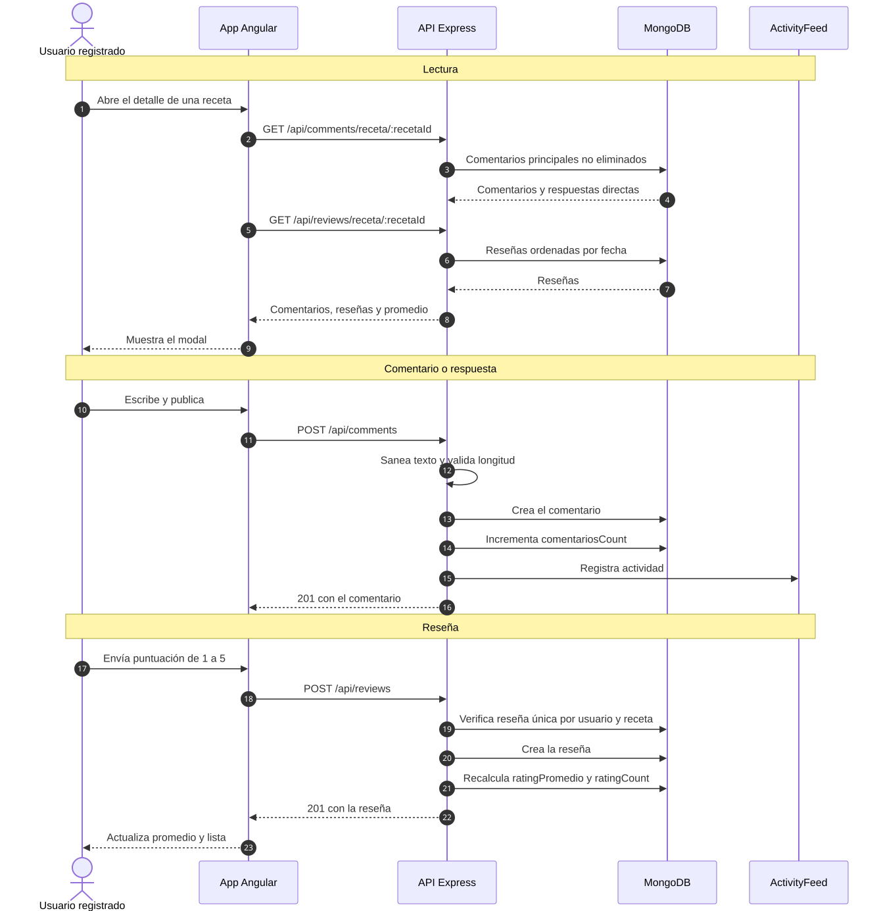
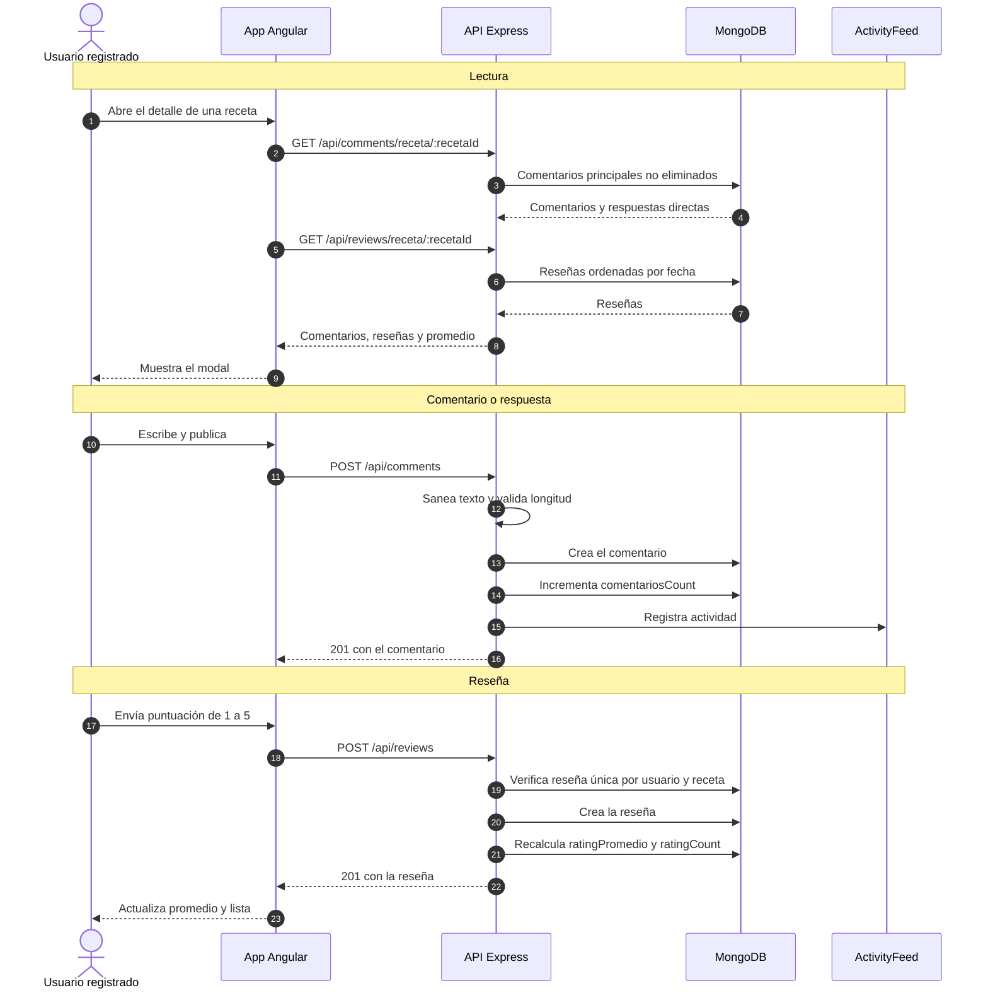

# Comentar y reseñar

Proceso: P05 Comentarios y reseñas.

Código Mermaid (editable)

```mermaid
%%{init: {"htmlLabels": false}}%%
sequenceDiagram
    autonumber
    actor U as Usuario registrado
    participant A as App Angular
    participant API as API Express
    participant DB as MongoDB
    participant F as ActivityFeed

    Note over U,F: Lectura
    U->>A: Abre el detalle de una receta
    A->>API: GET /api/comments/receta/:recetaId
    API->>DB: Comentarios principales no eliminados
    DB-->>API: Comentarios y respuestas directas
    A->>API: GET /api/reviews/receta/:recetaId
    API->>DB: Reseñas ordenadas por fecha
    DB-->>API: Reseñas
    API-->>A: Comentarios, reseñas y promedio
    A-->>U: Muestra el modal

    Note over U,F: Comentario o respuesta
    U->>A: Escribe y publica
    A->>API: POST /api/comments
    API->>API: Sanea texto y valida longitud
    API->>DB: Crea el comentario
    API->>DB: Incrementa comentariosCount
    API->>F: Registra actividad
    API-->>A: 201 con el comentario

    Note over U,F: Reseña
    U->>A: Envía puntuación de 1 a 5
    A->>API: POST /api/reviews
    API->>DB: Verifica reseña única por usuario y receta
    API->>DB: Crea la reseña
    API->>DB: Recalcula ratingPromedio y ratingCount
    API-->>A: 201 con la reseña
    A-->>U: Actualiza promedio y lista
```

