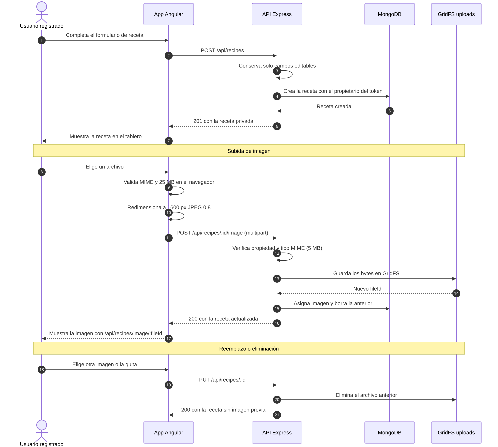
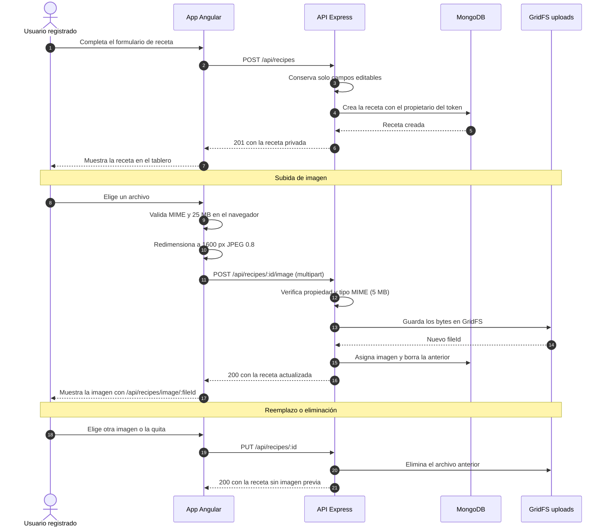

# Crear receta y gestionar imagen

Procesos: P02 Gestión de recetas y P03 Gestión de imágenes.

Código Mermaid (editable)

```mermaid
%%{init: {"htmlLabels": false}}%%
sequenceDiagram
    autonumber
    actor U as Usuario registrado
    participant A as App Angular
    participant API as API Express
    participant DB as MongoDB
    participant G as GridFS uploads

    U->>A: Completa el formulario de receta
    A->>API: POST /api/recipes
    API->>API: Conserva solo campos editables
    API->>DB: Crea la receta con el propietario del token
    DB-->>API: Receta creada
    API-->>A: 201 con la receta privada
    A-->>U: Muestra la receta en el tablero

    Note over U,G: Subida de imagen
    U->>A: Elige un archivo
    A->>A: Valida MIME y 25 MB en el navegador
    A->>A: Redimensiona a 1600 px JPEG 0.8
    A->>API: POST /api/recipes/:id/image (multipart)
    API->>API: Verifica propiedad y tipo MIME (5 MB)
    API->>G: Guarda los bytes en GridFS
    G-->>API: Nuevo fileId
    API->>DB: Asigna imagen y borra la anterior
    API-->>A: 200 con la receta actualizada
    A-->>U: Muestra la imagen con /api/recipes/image/:fileId

    Note over U,G: Reemplazo o eliminación
    U->>A: Elige otra imagen o la quita
    A->>API: PUT /api/recipes/:id
    API->>G: Elimina el archivo anterior
    API-->>A: 200 con la receta sin imagen previa
```

