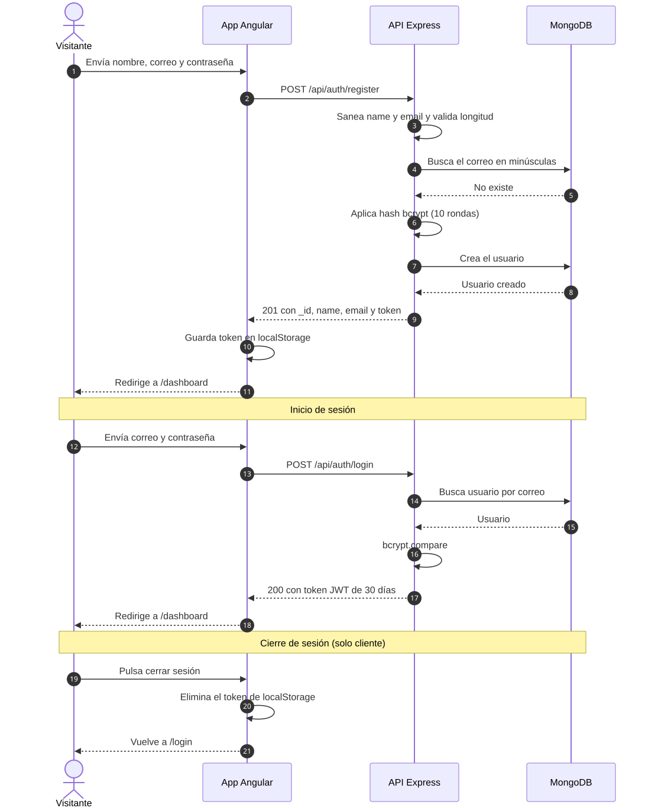
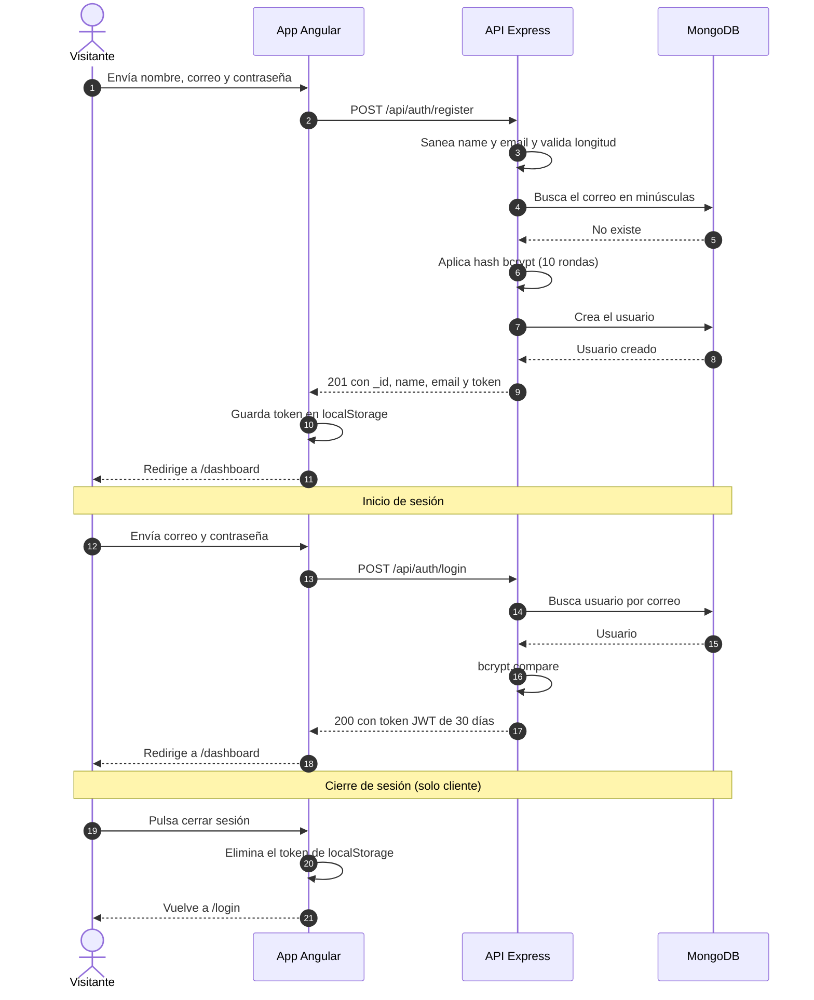

# Registro e inicio de sesión

Proceso: P01 Autenticación y sesión.

Código Mermaid (editable)

```mermaid
%%{init: {"htmlLabels": false}}%%
sequenceDiagram
    autonumber
    actor V as Visitante
    participant A as App Angular
    participant API as API Express
    participant DB as MongoDB

    V->>A: Envía nombre, correo y contraseña
    A->>API: POST /api/auth/register
    API->>API: Sanea name y email y valida longitud
    API->>DB: Busca el correo en minúsculas
    DB-->>API: No existe
    API->>API: Aplica hash bcrypt (10 rondas)
    API->>DB: Crea el usuario
    DB-->>API: Usuario creado
    API-->>A: 201 con _id, name, email y token
    A->>A: Guarda token en localStorage
    A-->>V: Redirige a /dashboard

    Note over V,DB: Inicio de sesión
    V->>A: Envía correo y contraseña
    A->>API: POST /api/auth/login
    API->>DB: Busca usuario por correo
    DB-->>API: Usuario
    API->>API: bcrypt.compare
    API-->>A: 200 con token JWT de 30 días
    A-->>V: Redirige a /dashboard

    Note over V,DB: Cierre de sesión (solo cliente)
    V->>A: Pulsa cerrar sesión
    A->>A: Elimina el token de localStorage
    A-->>V: Vuelve a /login
```

