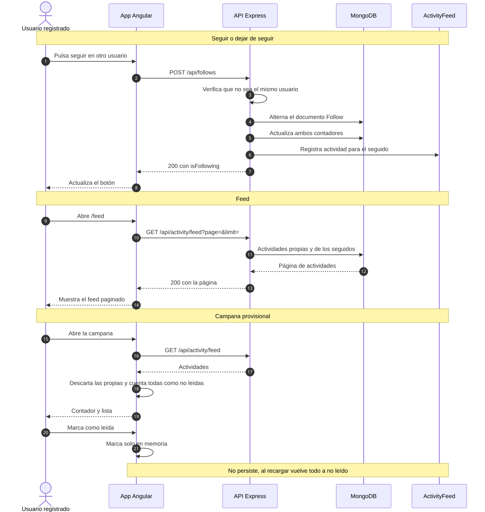
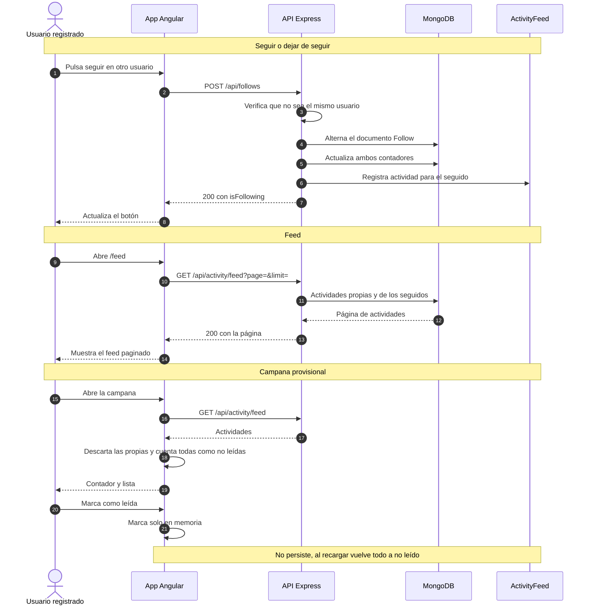

# Seguir usuarios y consultar el feed

Proceso: P06 Seguimiento, feed y notificaciones.

Código Mermaid (editable)

```mermaid
%%{init: {"htmlLabels": false}}%%
sequenceDiagram
    autonumber
    actor U as Usuario registrado
    participant A as App Angular
    participant API as API Express
    participant DB as MongoDB
    participant F as ActivityFeed

    Note over U,F: Seguir o dejar de seguir
    U->>A: Pulsa seguir en otro usuario
    A->>API: POST /api/follows
    API->>API: Verifica que no sea el mismo usuario
    API->>DB: Alterna el documento Follow
    API->>DB: Actualiza ambos contadores
    API->>F: Registra actividad para el seguido
    API-->>A: 200 con isFollowing
    A-->>U: Actualiza el botón

    Note over U,F: Feed
    U->>A: Abre /feed
    A->>API: GET /api/activity/feed?page=&limit=
    API->>DB: Actividades propias y de los seguidos
    DB-->>API: Página de actividades
    API-->>A: 200 con la página
    A-->>U: Muestra el feed paginado

    Note over U,F: Campana provisional
    U->>A: Abre la campana
    A->>API: GET /api/activity/feed
    API-->>A: Actividades
    A->>A: Descarta las propias y cuenta todas como no leídas
    A-->>U: Contador y lista
    U->>A: Marca como leída
    A->>A: Marca solo en memoria
    Note over A,F: No persiste, al recargar vuelve todo a no leído
```

