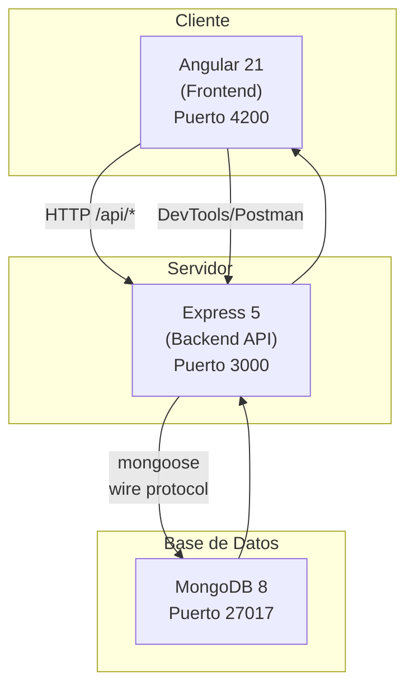
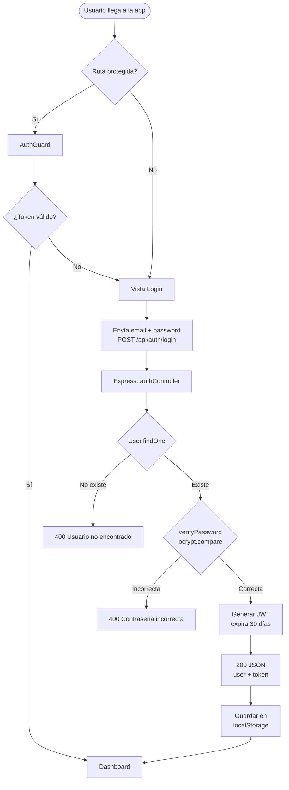
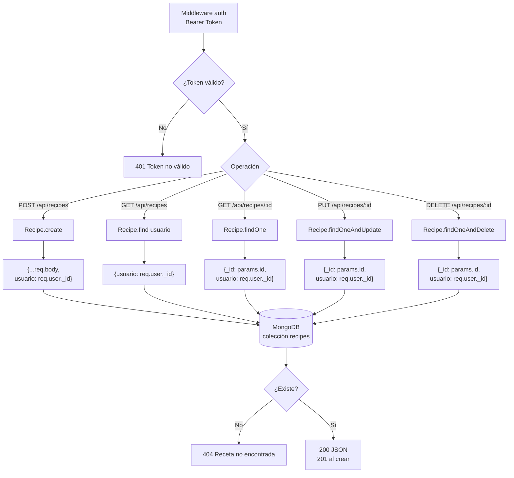
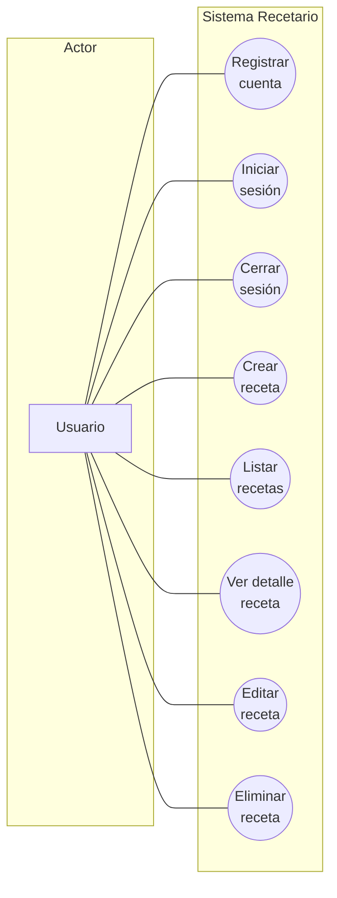
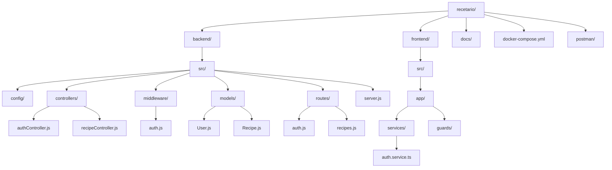

# 📊 Diagramas de la Aplicación - Recetario

## 🏗️ Diagrama de Arquitectura (Stack MEAN)

## 🔄 Diagrama de Flujo - Autenticación (Registro/Login)

## 📝 Diagrama de Flujo - CRUD de Recetas

## 👥 Casos de Uso del Sistema

## 📋 Tabla de Casos de Uso

| # | Caso de Uso | Actor | Descripción | Precondición |
|---|-------------|-------|-------------|--------------|
| 1 | Registrar cuenta | Usuario | Crear cuenta con nombre, email y contraseña | No estar registrado |
| 2 | Iniciar sesión | Usuario | Autenticarse con email y contraseña | Tener cuenta |
| 3 | Cerrar sesión | Usuario | Eliminar token y volver al login | Estar autenticado |
| 4 | Crear receta | Usuario | Agregar receta con título, descripción, ingredientes e instrucciones | Estar autenticado |
| 5 | Listar recetas | Usuario | Ver todas sus recetas | Estar autenticado |
| 6 | Ver detalle | Usuario | Consultar una receta por ID | Estar autenticado |
| 7 | Editar receta | Usuario | Modificar datos de una receta propia | Ser el dueño |
| 8 | Eliminar receta | Usuario | Borrar una receta propia | Ser el dueño |

## 🗂️ Diagrama de la Estructura del Proyecto

